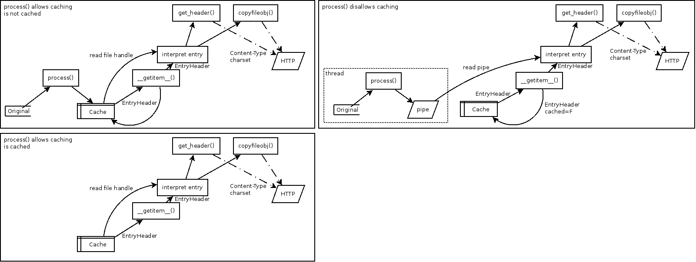
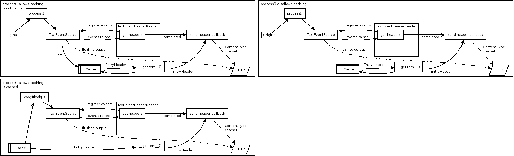

wikiserv
========

Wiki server with manual editing of text files as backend, with a selectable filter
converting them to HTML and a caching mechanism.


Justification
-------------

I've tried using purely web-based wikis like [MediaWiki](http://www.mediawiki.org/wiki/MediaWiki]),
but the database and server maintenance involved with them have always ended up
leaving me neglecting them.  This time, I'm going to try something a bit
different.

Requirements
------------
1. Python 3 (3.3 or newer)
2. [pytz](http://pytz.sourceforge.net/)
3. [python-dateutil](http://labix.org/python-dateutil)
4. [lxml](http://lxml.de/)
5. [chardet](http://pypi.python.org/pypi/chardet)
6. [python-magic](http://github.com/ahupp/python-magic)
7. [tornado](http://www.tornadoweb.org/)
8. An OS that supports the built-in [fcntl](http://docs.python.org/3.3/library/fcntl.html) module
7. [asciidoc](http://www.methods.co.nz/asciidoc/) in PATH (optional)
8. [markdown](http://pypi.python.org/pypi/Markdown) for Python (optional)

Configuration
-------------


```xml
<?xml version="1.0" ?>

<configuration>
	<log-level>DEBUG</log-level><!-- Passed to logging module -->
	<bind-address>127.0.0.1</bind-address><!-- OPTIONAL: address to bind to -->
	<bind-port>8080</bind-port><!-- Port to bind to -->
	<document-root>testdata/test_root</document-root><!-- Root of directory containing files which will be procesed and served -->
	<preview-lines>5</preview-lines><!-- OPTIONAL: When performing a search, show this many lines from the source document -->
	<worker-threads>4</worker-threads><!-- OPTIONAL: Number of all-purpose worker threads to spawn.  DEFAULT: 1 -->
	<cache>
		<cache-dir>testdata/test_cache</cache-dir><!-- Root of cache directory -->
		<checksum-function>sha1</checksum-function><!-- Checksum algorithm used on the files to be processed to determine cache state -->
		<max-age>86400</max-age><!-- OPTIONAL: Whenever a scrub is performed, delete files that are older than this age (seconds) -->
		<max-entries>2048</max-entries><!-- OPTIONAL: Use an LRU algorithm to limit the approximate maximum number of entries in the cache -->
		<auto-scrub /><!-- OPTIONAL: When the LRU algorithm hits the maximum number of entries, automatically scrub the cache to clear up free slots -->
		<dispatcher-threar /><!-- OPTIONAL: Use the DispatcherCache class instead, which will perform automatic scrubbing in a separate thread -->
		<send-etags /><!-- OPTIONAL: Send Etags based on checksum algorithm -->
	</cache>
	<processors>
		<encoding>utf8</encoding><!-- Output encoding passed to all the processors -->
		<processor>asciidoc-xhtml11</processor><!-- OPTIONAL: Sets the default processor used to convert files to HTML -->
		<!-- If no default processor is specified, the 'autoraw-nocache' processor is used -->
		<processor extensions="txt foo">asciidoc-xhtml11</processor><!-- For the extensions txt and foo, use this processor to convert -->
		<processor extensions="bar">asciidoc-html5</processor><!-- For the extensions bar, used asciidoc-html5 instead -->
	</processors>
</configuration>
```

Help
----

Since Python's [argparse](https://docs.python.org/3/library/argparse.html) module
is used for parsing arguments, `--help` will provide some advice.

```
usage: server.py [ options ] -c config.xml 

optional arguments:
  -h, --help            show this help message and exit
  --config CONFIG.XML, -c CONFIG.XML
                        XML configuration file
  --scrub               Instead of running the server, just do a cache scrub
  --bind-address ADDRESS
                        Bind to ADDRESS instead of the address specified in
                        configuration
  --bind-port ADDRESS   Bind to ADDRESS instead of the port specified in
                        configuration
```

Design
------

1. File locking everywhere to keep things consistent _within_ the server processes
   and threads.

2. Raw source files will be used as the input, which can be modified whenever.

3. A caching system with a directory tree that corresponds to the source
   (asciidoc, etc.) structure.

    1. Web server processes will have a shared lock on a toplevel `.lock`
       file.
    2. Other threads and processes will have an exclusive lock on a toplevel
       `.lock` file.

4. The caching system will have two methods of cleanup.

    1. A time to live system that with a configurable maximum age.  The
       cleanup process will have to be scheduled in cron or something
       similar.
    2. An optional LRU-based system that will delete the oldest entry
       when there are too many sitting around.  A thread will run in the
       background will have this task dispatched to it.

5. The caching system will use file size, file modification time, and a
   configurable checksum to check for changes in source files.

6. The actual filter will be configurable and replaceable, with
   [asciidoc](http://www.methods.co.nz/asciidoc/) as both the initial
   and reference implementation.

7. Any source file revision control is left to the person managing the
   source directory tree.

### TextEvent

As of the **cached-search** tag, the following setup is used.  An arrow
going downward means writing and an arrow going upward means reading.

* `os.utime` always updates modification time of the cache
  entries themselves.  This is the only timestamp used in `scrub()`.)
* When caching is disallowed, the headers always have their entries
  updated.



Because of how the `process()` methods write directly to a handle, it is
very difficult to operate with caching disallowed.  The current kludge
is to use a thread and a pipe to facilitate a pseudo-temporary file.
This isn't ideal.

A better solution is being worked on, using a design where the writing
done by `process()` is actually triggering events on an object which
will execute callbacks upon said events.

**NOTE:** For now, only the non-caching mode will use the TextEvent API,
to decouple the cache writing and sending on the network in the event of
an I/O error.



With this setup, writing to the cache is accomplished with a tee,
reading from it is a simple `shutil.copyfileobj()`, and disallowing the
cache just removes the tee.  The `process()` setup doesn't need to
change at all.
